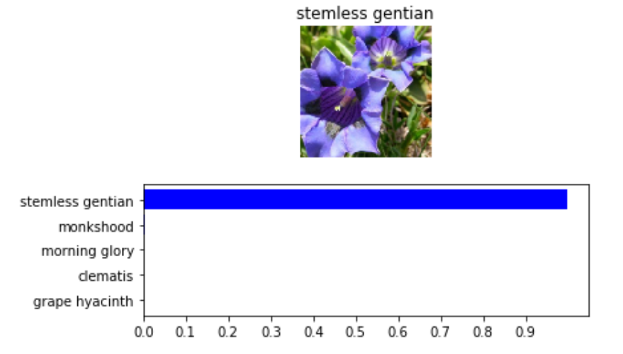
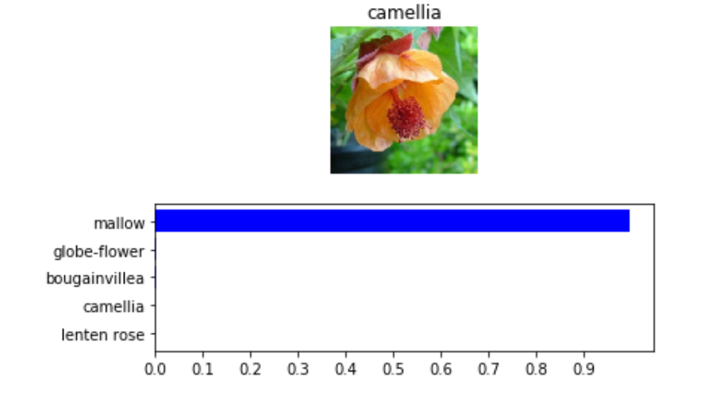

# Flower Image Classifier

In this project, we've built a Python application that can train an deep-learning flower image classifier on a dataset, then predict new flower images using the trained model. In the foirst part of the project, we've developed our code in a Jupyter notebook to make sure our implementaion works.In the second part, we've converted the code in a Python application that runs form the command line. 

## Part 1- Developing a Image Classifer with Deep Learning

In this notebook, we've learned how to use pre-trained networks to solved challenging problems in computer vision such as Flower Image Classification. Specifically, we've used networks trained on ImageNet available from torchvision.

ImageNet is a massive dataset with over 1 million labeled images in 1000 categories. It's used to train deep neural networks using an architecture called convolutional layers. Once trained, these models work astonishingly well as feature detectors for images they weren't trained on. Using a pre-trained network on images not in the training set is called transfer learning. Here we'll use transfer learning to train a network that can classify flower images with near perfect accuracy.

Most of the pretrained models require the input to be 224x224 images. Also, we'll need to match the normalization used when the models were trained. Each color channel was normalized separately, the means are [0.485, 0.456, 0.406] and the standard deviations are [0.229, 0.224, 0.225].

This model is built out of two main parts, the features and the classifier. The features part is a stack of convolutional layers and overall works as a feature detector that can be fed into a classifier. The classifier part is a single fully-connected layer (classifier): Linear(in_features=1024, out_features=1000). Since in our problem, we have 102 flower species in the our training dataset, so it won't work for our specific problem. That means we need to replace the classifier, but the features will work perfectly on their own. Just need to make sure we are only training the classifier and the parameters for the features part are frozen.

In our training, we've used DenseNet model (densenet161 and densenet201) and got an accuracy over 97% on the testing dataset. Some hyperparameter settings, statistics and inference results are given below:

### HyperParameters
|      Hyperparameter    |       Value       |
| :--------------------: |:-----------------:|
|     Learning Rate		 |       0.001       |
|        Epochs  		 |        30         |
|     Hidden Nodes		 |       512         |

### Accuracy and Error rate on testing dataset
|         Model          |      Accuracy     | Top-1 Error Rate | Top-3 Error Rate | Top-5 Error Rate |
| :--------------------: | :---------------: | :--------------: | :--------------: | :--------------: | 
| Pretrained Densenet161 |      97.31%       |      2.69%       |      0.73%       |      0.24%       |

### Correctly Classified Images

### Top-3 Error Image

### Top-5 Error Image

